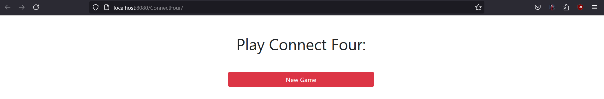
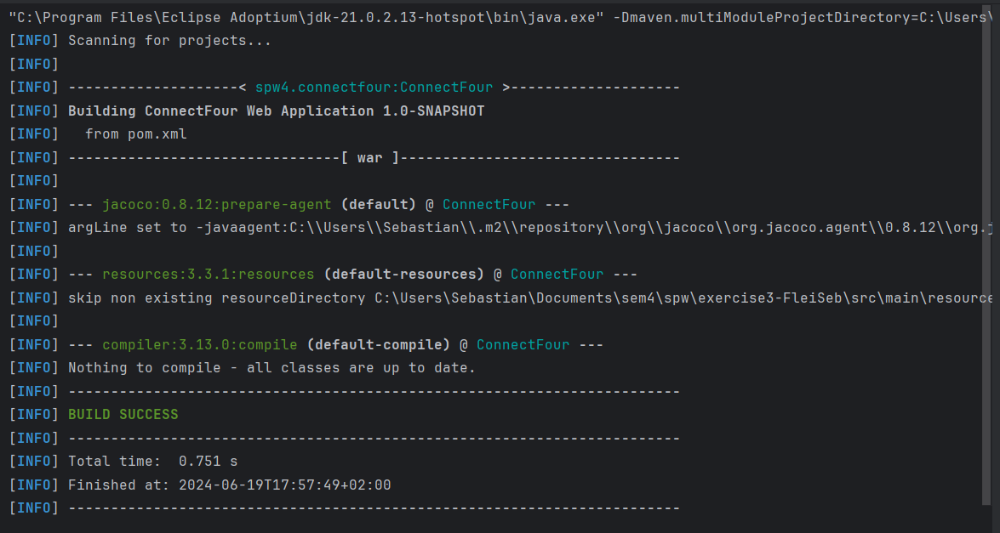
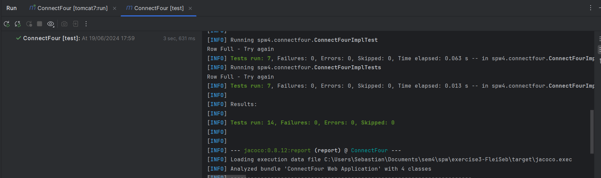
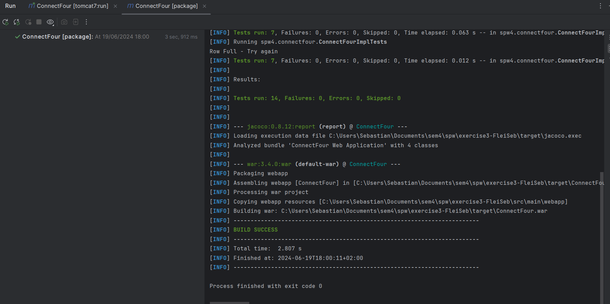
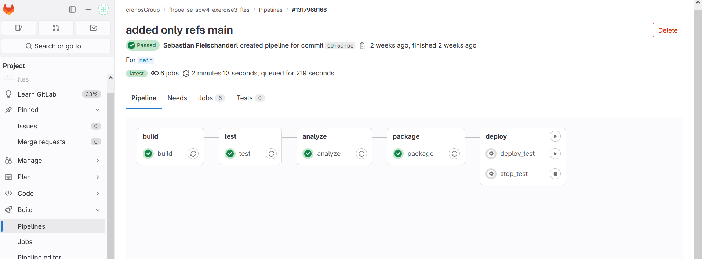
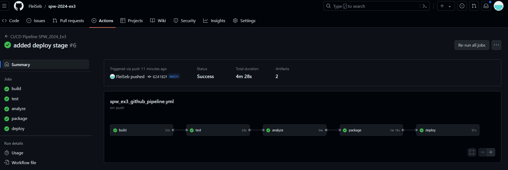

SPW4 - Exercise 3
=================

Name: _____________

Effort in hours: __

## 1. Connect Four Web Application and CI/CD Pipeline

### Task 1.a

Tomcat starts successfully and connect four is playable

Maven Compile: 

Maven test:

Maven package:

### Task 1.b
The pipeline works as expected, you can see it runs through all cases required

### Task 1.c
Pretty much the same pipeline, but now runs on github instead of gitlab
differs in analyze step => uses maven analyze

